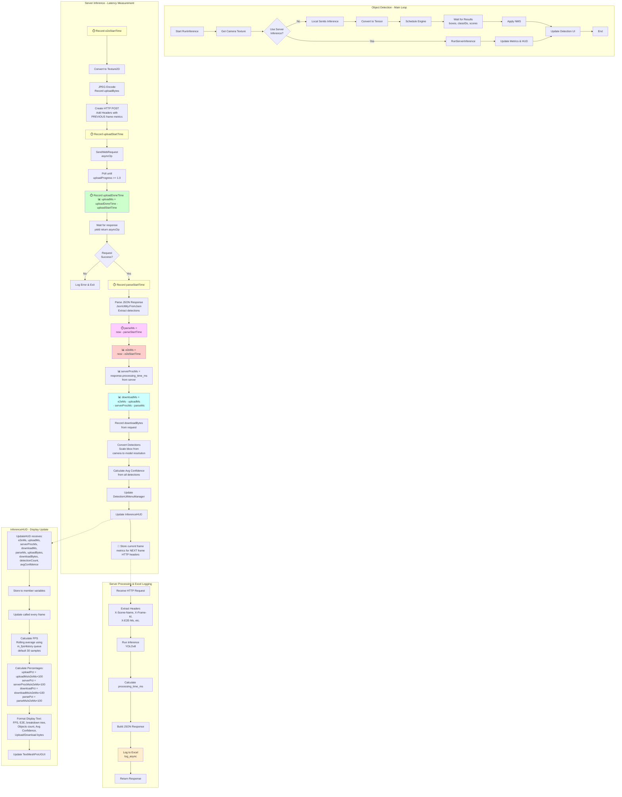
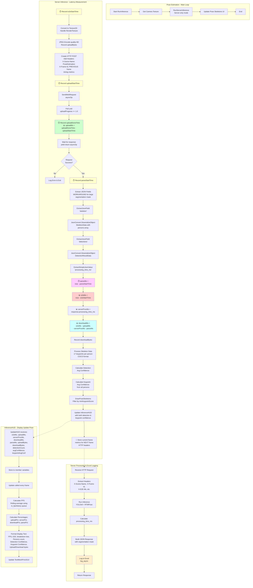

# Metrics & Latency Measurement Process Comparison

## Overview

This document provides a detailed comparison of the metrics and latency measurement processes between **Object Detection** and **Pose Estimation** modes. Understanding these differences is crucial for performance optimization and identifying latency bottlenecks.

---

## Table of Contents

1. [Flow Diagrams](#flow-diagrams)
   - [Object Detection Flow](#1-object-detection-flow)
   - [Pose Estimation Flow](#2-pose-estimation-flow)
2. [Field Definitions](#field-definitions)
   - [Unity Client-Side Fields](#unity-client-side-fields)
   - [HTTP Header Fields](#http-header-fields)
   - [Server-Side Fields](#server-side-fields)
   - [Excel Output Fields](#excel-output-fields)
3. [Key Differences Summary](#key-differences-summary)
4. [Latency Components Breakdown](#latency-components-breakdown)
5. [Factors Affecting Latency](#factors-affecting-latency)
6. [Process Comparison Table](#process-comparison-table)
7. [Performance Implications](#performance-implications)

---

## Flow Diagrams

### 1. Object Detection Flow



---

### 2. Pose Estimation Flow



---

## Field Definitions

### Unity Client-Side Fields

These fields are calculated and stored on the Unity client (Quest headset).

#### Latency Metrics

| Field Name | Type | Unit | Definition | Code Location | Calculation Method | Typical Range |
|------------|------|------|------------|---------------|-------------------|---------------|
| **e2eMs** | `float` | milliseconds | **End-to-end total latency** from the moment inference request starts until all processing completes | `m_e2eMs` | `(Time.realtimeSinceStartup - e2eStartTime) * 1000f` | 200-800ms |
| **uploadMs** | `float` | milliseconds | Time taken to **upload image to server** (JPEG encoding + HTTP upload) | `m_uploadMs` | `(uploadDoneTime - uploadStartTime) * 1000f` | 20-50ms |
| **serverProcMs** | `float` | milliseconds | **Server-side processing time** for inference (from server response) | `m_serverProcMs` | Extracted from `response.processing_time_ms` | 50-300ms |
| **downloadMs** | `float` | milliseconds | Time taken to **download response from server** | `m_downloadMs` | `e2eMs - uploadMs - serverProcMs - parseMs` | 20-400ms |
| **parseMs** | `float` | milliseconds | Time taken to **parse JSON response** into Unity data structures | `m_parseMs` | `(Time.realtimeSinceStartup - parseStartTime) * 1000f` | 5-50ms |

**Latency Formula**:
```
e2eMs = uploadMs + serverProcMs + downloadMs + parseMs
```

---

#### Data Size Metrics

| Field Name | Type | Unit | Definition | Code Location | Calculation Method | Typical Value |
|------------|------|------|------------|---------------|-------------------|---------------|
| **uploadBytes** | `int` | bytes | Size of **uploaded data** (JPEG image + HTTP headers) | `m_uploadBytes` | `jpegBytes.Length` | 100,000-150,000 |
| **downloadBytes** | `int` | bytes | Size of **downloaded data** (JSON response body) | `m_downloadBytes` | `(int)request.downloadedBytes` | 425,000-440,000 |

---

#### Frame Tracking

| Field Name | Type | Unit | Definition | Code Location | Calculation Method | Notes |
|------------|------|------|------------|---------------|-------------------|-------|
| **m_frameId** | `int` | count | **Sequential frame counter** incremented on each inference request | `m_frameId` | `m_frameId++` | Starts at 1 |
| **m_lastUpdateTime** | `float` | seconds | **Timestamp of last HUD update** used for FPS calculation | `m_lastUpdateTime` | `Time.time` | Unity time |

---

#### FPS Metrics

| Field Name | Type | Unit | Definition | Code Location | Calculation Method | Default Value |
|------------|------|------|------------|---------------|-------------------|---------------|
| **m_fpsHistory** | `Queue<float>` | frames/sec | **Rolling window of FPS samples** | `m_fpsHistory` | Queue of `1f / deltaTime` | 30 samples |
| **avgFPS** | `float` | frames/sec | **Average FPS** calculated from history queue | Local variable | `m_fpsHistory.Average()` | 60-72 |
| **m_fpsAverageSamples** | `int` | count | **Number of frames to average** for FPS calculation | Inspector field | User configurable | 30 |

**⚠️ IMPORTANT - FPS Interpretation**:

The FPS shown in the HUD is **Unity's rendering frame rate** (Update() frequency), **NOT the inference frame rate**!

- **Displayed FPS**: 60-72 (Quest display refresh rate)
- **Actual Inference FPS**: 1-5 FPS (depends on E2E latency)

**Calculation**:
```csharp
deltaTime = Time.time - m_lastUpdateTime;  // Time between Update() calls
currentFPS = 1f / deltaTime;                // Rendering FPS, not inference FPS
```

**To calculate actual Inference FPS**:
```
Inference FPS = 1000 / E2E latency (ms)

Examples:
- E2E = 200ms → Inference FPS = 5.0
- E2E = 500ms → Inference FPS = 2.0
- E2E = 800ms → Inference FPS = 1.25
```

**Why this happens**:
- `Update()` runs every rendering frame (72 Hz on Quest)
- Inference runs in a separate coroutine asynchronously
- HUD measures rendering loop, not inference loop

**Design Issue**: The current FPS metric is misleading and should ideally show inference throughput instead of rendering frame rate.

---

#### Detection & Confidence Metrics

| Field Name | Type | Unit | Definition | Object Detection | Pose Estimation |
|------------|------|------|------------|------------------|-----------------|
| **detectionCount** | `int` | count | Number of detected objects/persons | `response.detections?.detections?.Length ?? 0` | `response.skeleton?.persons?.Count ?? 0` |
| **avgConfidence** | `float` | 0.0-1.0 | Average confidence score | Sum of detection confidences / count | Sum of detection confidences / count |
| **keypointAvgConf** | `float` | 0.0-1.0 | Average keypoint confidence | N/A (not used) | Sum of all keypoint scores / total keypoints |

---

### HTTP Header Fields

These headers are sent **from Unity to Server** with each inference request. They contain metrics from the **PREVIOUS frame (N-1)**.

| Header Name | Type | Unit | Definition | Example Value | Source Field |
|-------------|------|------|------------|---------------|--------------|
| **X-Scene-Name** | `string` | - | Unity scene name for server logging | `"MultiObjectDetection"` or `"PoseEstimation"` | Hardcoded |
| **X-Frame-Id** | `int` | count | Frame counter for correlation | `42` | `m_frameId` |
| **X-E2E-Ms** | `float` | ms | **Previous frame** E2E latency | `245.1` | `m_lastE2eMs` |
| **X-Upload-Ms** | `float` | ms | **Previous frame** upload time | `45.2` | `m_lastUploadMs` |
| **X-Download-Ms** | `float` | ms | **Previous frame** download time | `35.8` | `m_lastDownloadMs` |
| **X-Parse-Ms** | `float` | ms | **Previous frame** parse time | `15.3` | `m_lastParseMs` |
| **X-Upload-Bytes** | `int` | bytes | **Previous frame** upload size | `128000` | `m_lastUploadBytes` |
| **X-Download-Bytes** | `int` | bytes | **Previous frame** download size | `49800` | `m_lastDownloadBytes` |

**⚠️ Important**: Headers contain metrics from **frame N-1**, not current frame N. Values are `0` for the first frame.

**Code Location**: `SentisInferenceRunManager.cs:390-401` and `PoseInferenceRunManager.cs:219-230`

---

### Server-Side Fields

These fields are calculated on the Python server during inference.

| Field Name | Type | Unit | Definition | Calculation Method | Code Location |
|------------|------|------|------------|-------------------|---------------|
| **processing_time_ms** | `float` | ms | **Server inference time** from image decode to response build | `(time.time() - start_time) * 1000.0` | `infer_human.py:359` |
| **model_input_width** | `int` | pixels | Model input width (YOLO/RTMPose) | From inference results | Default: 640 |
| **model_input_height** | `int` | pixels | Model input height (YOLO/RTMPose) | From inference results | Default: 640 |
| **input_image_width** | `int` | pixels | Original uploaded image width | `pil_image.size[0]` | Typical: 1280 |
| **input_image_height** | `int` | pixels | Original uploaded image height | `pil_image.size[1]` | Typical: 960 |

---

#### Server-Side Calculated Percentages

| Field Name | Type | Unit | Definition | Calculation Method | Code Location |
|------------|------|------|------------|-------------------|---------------|
| **server_pct** | `float` | % | Server processing percentage of E2E | `(processing_time_ms / e2e_ms) * 100.0` | `infer_human.py:437` |
| **upload_pct** | `float` | % | Upload percentage of E2E | `(upload_ms / e2e_ms) * 100.0` | `infer_human.py:438` |
| **download_pct** | `float` | % | Download percentage of E2E | `(download_ms / e2e_ms) * 100.0` | `infer_human.py:439` |

**Note**: Percentages are only calculated if `e2e_ms > 0` (i.e., Unity headers available). Otherwise defaults to 100% server, 0% upload/download.

---

### Excel Output Fields

The server logs all metrics to daily Excel files (`inference_log_YYYY-MM-DD.xlsx` in `debug/logs/` folder). Only frames **with detections** are logged.

**File Path**: `debug/logs/inference_log_2026-04-06.xlsx`

#### Excel Column Definitions

| Column Name | Type | Unit | Definition | Source | Example Value | Notes |
|-------------|------|------|------------|--------|---------------|-------|
| **timestamp** | `string` | - | Timestamp when server received request | `datetime.now()` | `"2026-04-06 14:23:45.123"` | Millisecond precision |
| **scene** | `string` | - | Unity scene name | `X-Scene-Name` header | `"MultiObjectDetection"` or `"PoseEstimation"` | From client |
| **frame_id** | `int` | count | Frame counter from client | `X-Frame-Id` header | `42` | From client |
| **latency_ms** | `float` | ms | **End-to-end latency** (Unity → Server → Unity) | `X-E2E-Ms` header OR `processing_time_ms` | `245.1` | Client E2E if available, else server time |
| **server_proc_ms** | `float` | ms | **Server processing time** (inference only) | Calculated on server | `150.0` | Server-measured |
| **upload_ms** | `float` | ms | Upload time (client-side measurement) | `X-Upload-Ms` header | `45.2` | From client |
| **download_ms** | `float` | ms | Download time (client-side measurement) | `X-Download-Ms` header | `35.8` | From client |
| **parse_ms** | `float` | ms | JSON parse time (client-side measurement) | `X-Parse-Ms` header | `15.3` | From client |
| **upload_bytes** | `int` | bytes | Upload data size | `X-Upload-Bytes` header | `128000` | ~125KB typical |
| **download_bytes** | `int` | bytes | Download data size | `X-Download-Bytes` header | `49800` | 50KB-2MB range |
| **server_pct** | `float` | % | Server processing percentage of E2E | `(server_proc_ms / latency_ms) * 100` | `61.2` | Calculated |
| **upload_pct** | `float` | % | Upload percentage of E2E | `(upload_ms / latency_ms) * 100` | `18.4` | Calculated |
| **download_pct** | `float` | % | Download percentage of E2E | `(download_ms / latency_ms) * 100` | `14.6` | Calculated |
| **detection_count** | `int` | count | Number of detected objects/persons | From inference results | `3` | Only frames with count > 0 are logged |
| **avg_confidence** | `float` | 0.0-1.0 | Average detection confidence | Average of all detection confidences | `0.8521` | Rounded to 4 decimals |
| **keypoint_avg_conf** | `float` | 0.0-1.0 | Average keypoint confidence | Average of all keypoint scores | `0.6541` | 0.0 for Object Detection mode |
| **image_width** | `int` | pixels | Input image width | From uploaded image | `1280` | Original size |
| **image_height** | `int` | pixels | Input image height | From uploaded image | `960` | Original size |
| **model_used** | `string` | - | Model identifier | Server inference mode | `"yolo+pose_both"` or `"yolo+pose_detection"` | Indicates which models ran |

---

#### Excel Logging Behavior

**Filter Rule**: Only frames with `detection_count > 0` are logged to Excel.

**File Organization**:
- Daily log files: One file per day
- File naming: `inference_log_YYYY-MM-DD.xlsx`
- Location: `vision_server/debug/logs/`
- Sheet name: `"InferenceLog"`
- Header row: Row 1 (bold font)
- Data rows: Appended sequentially

**Threading**: Logging is done asynchronously via `log_async()` to avoid blocking inference.

**Code Locations**:
- Logger: `debug/inference_logger.py`
- Log call: `app/routes/infer_human.py:447-466`

---

#### Example Excel Row

| timestamp | scene | frame_id | latency_ms | server_proc_ms | upload_ms | download_ms | parse_ms | upload_bytes | download_bytes | server_pct | upload_pct | download_pct | detection_count | avg_confidence | keypoint_avg_conf | image_width | image_height | model_used |
|-----------|-------|----------|------------|----------------|-----------|-------------|----------|--------------|----------------|------------|------------|--------------|-----------------|----------------|-------------------|-------------|--------------|------------|
| 2026-04-06 14:23:45.123 | PoseEstimation | 42 | 487.3 | 234.5 | 45.2 | 192.3 | 15.3 | 128000 | 1847296 | 48.1 | 9.3 | 39.5 | 1 | 0.7823 | 0.6541 | 1280 | 960 | yolo+pose_both |
| 2026-04-06 14:23:45.678 | MultiObjectDetection | 43 | 245.1 | 123.4 | 40.0 | 55.3 | 26.4 | 125000 | 51200 | 50.3 | 16.3 | 22.6 | 3 | 0.8521 | 0.0 | 1280 | 960 | yolo+pose_detection |

---

## Key Differences Summary

| Aspect | Object Detection | Pose Estimation |
|--------|-----------------|-----------------|
| **Inference Mode** | Dual-path: Local Sentis OR Server | **Server-only** (no local option) |
| **JSON Parser** | `JsonUtility.FromJson` (Unity built-in) | `Newtonsoft.Json` + **custom field extraction** |
| **Response Size** | ~425KB (includes segmentation + depth) | ~435KB (includes segmentation + depth) |
| **Parse Complexity** | Simple, direct deserialization | **Complex: manual field extraction** to bypass mask |
| **Data Structure** | Bounding boxes (4 floats per detection) | **Skeleton: 17 keypoints × 3 values per person** |
| **Confidence Metrics** | Single: detection confidence | **Dual: detection + keypoint confidence** |
| **Server Models** | YOLOv8 only | **YOLOv8 + RTMPose** (two-stage pipeline) |
| **HTTP Headers** | X-Scene-Name: "MultiObjectDetection" | X-Scene-Name: "PoseEstimation" |
| **UpdateHUD Parameters** | 9 parameters | **10 parameters** (adds keypointAvgConf) |
| **Excel keypoint_avg_conf** | Always `0.0` | `0.0-1.0` (actual keypoint scores) |

---

## Latency Components Breakdown

### Common Formula (Both Modes)

```
E2E Latency = Upload Time + Server Processing + Download Time + Parse Time
```

### 1. Upload Time (📤)

**Measurement Method**:
```csharp
uploadStartTime = Time.realtimeSinceStartup;
// ... SendWebRequest() ...
// Poll until uploadProgress >= 1.0
uploadDoneTime = Time.realtimeSinceStartup;
uploadMs = (uploadDoneTime - uploadStartTime) * 1000f;
```

**What It Includes**:
- JPEG encoding (EncodeToJPG)
- Multipart form data creation
- HTTP request header construction
- Network transmission to server

**Factors Affecting Upload**:
- Image resolution (1280×960 typical)
- JPEG quality setting (90 for both modes)
- WiFi signal strength
- Network bandwidth
- Server distance/latency

**Typical Range**:
- Good WiFi: 20-50ms
- Poor WiFi: 100-300ms

---

### 2. Server Processing Time (🖥️)

**Measurement Method**:
```python
# Server-side (Python)
start_time = time.time()
# ... run inference ...
processing_time_ms = (time.time() - start_time) * 1000.0
```

**What It Includes**:

#### Object Detection:
- Image decoding
- YOLOv8 inference
- Post-processing (NMS, filtering)
- JSON serialization

#### Pose Estimation:
- Image decoding
- YOLOv8 detection (stage 1)
- RTMPose keypoint estimation (stage 2)
- Segmentation mask generation
- JSON serialization

**Factors Affecting Server Processing**:
- Server GPU type (CUDA availability)
- Number of objects/persons detected
- Image resolution
- Model complexity
- Server CPU/GPU load

**Typical Range**:
- Object Detection: 50-150ms
- Pose Estimation: **150-300ms** (higher due to two-stage pipeline)

---

### 3. Download Time (📥)

**Measurement Method** (Calculated by subtraction):
```csharp
downloadMs = e2eMs - uploadMs - serverProcMs - parseMs;
```

**What It Includes**:
- Network transmission from server to client
- HTTP response header reception
- Response body streaming

**Factors Affecting Download**:
- **Response payload size**
  - Both modes: **~425-440KB** (includes segmentation mask + depth map)
  - **Minimal difference** between modes (~5-10KB for skeleton data)
  - Server returns full response structure for all modes (lines 261-275 in `infer_human.py`)
- WiFi signal strength
- Network bandwidth
- Server distance/latency

**Typical Range**:
- Object Detection: 80-120ms
- Pose Estimation: 80-120ms

**Note**: Both modes have similar download times because both return segmentation mask (75KB) and depth map (300KB).

---

### 4. Parse Time (📋)

**Measurement Method**:
```csharp
parseStartTime = Time.realtimeSinceStartup;
// ... JSON parsing ...
parseMs = (Time.realtimeSinceStartup - parseStartTime) * 1000f;
```

**What It Includes**:

#### Object Detection:
- `JsonUtility.FromJson<ServerResponse>(jsonResponse)`
- Simple data structure (detections array)

#### Pose Estimation:
- **Custom field extraction** (ExtractJsonField)
  - Manually parse skeleton field
  - Manually parse detections field
  - Extract processing_time_ms
- `JsonConvert.DeserializeObject<SkeletonData>(skeletonJson)`
- `JsonConvert.DeserializeObject<DetectionResultData>(detectionsJson)`

**Why Pose Estimation Uses Custom Extraction**:
- Full JSON parsing FAILS due to massive segmentation mask array (500K-2M+ elements)
- Unity/Newtonsoft runs out of memory or takes 5-10 seconds
- Solution: Extract only needed fields, skip mask entirely

**Factors Affecting Parse**:
- JSON size
- Data structure complexity
- Parser efficiency
- Unity's memory allocator

**Typical Range**:
- Object Detection: 5-15ms (simple parsing)
- Pose Estimation: **15-50ms** (custom extraction overhead)

---

## Factors Affecting Latency

### 🔴 Critical Factors (High Impact)

| Factor | Impact Area | Object Detection | Pose Estimation | Mitigation Strategy |
|--------|-------------|------------------|-----------------|---------------------|
| **WiFi Signal** | Upload + Download | ±100-200ms | ±100-200ms | Move closer to router, use 5GHz band |
| **Response Size** | Download | ~425KB | ~435KB | Both modes include segmentation + depth (minimal difference) |
| **Server GPU** | Server Processing | 50-150ms | 150-300ms | Use CUDA-enabled GPU, optimize model |
| **Image Resolution** | Upload + Server | 1280×960 baseline | 1280×960 baseline | Lower resolution (affects accuracy) |
| **Network Bandwidth** | Upload + Download | Medium impact | Medium impact | Use wired ethernet, upgrade WiFi |

### 🟡 Moderate Factors (Medium Impact)

| Factor | Impact Area | Object Detection | Pose Estimation | Mitigation Strategy |
|--------|-------------|------------------|------------------|---------------------|
| **JPEG Quality** | Upload | 90 quality baseline | 90 quality baseline | Lower to 70-80 (slight quality loss) |
| **Detection Count** | Server Processing | ±20ms per 5 objects | ±50ms per 5 persons | Adjust confidence threshold |
| **Parse Complexity** | Parse | Simple (5-15ms) | **Complex (15-50ms)** | Already optimized with field extraction |
| **JSON Serialization** | Server | Small overhead | Large overhead | Server: Use binary format (protobuf) |

### 🟢 Minor Factors (Low Impact)

| Factor | Impact Area | Impact | Notes |
|--------|-------------|--------|-------|
| **Frame ID** | HTTP Headers | <1ms | Negligible |
| **Header Count** | HTTP | <1ms | 8 headers sent per request |
| **Confidence Calculation** | Client Processing | <1ms | Simple averaging |
| **HUD Update** | Display | <1ms | TextMeshPro is optimized |

---

## Process Comparison Table

### Inference Pipeline

| Step | Object Detection | Pose Estimation | Key Difference |
|------|-----------------|-----------------|----------------|
| **1. Get Texture** | PassthroughCameraAccess | PassthroughCameraAccess | ✅ Same |
| **2. Inference Mode** | Local Sentis OR Server | **Server only** | 🔴 Pose has no local option |
| **3. Texture Conversion** | Texture2D or RenderTexture | Texture2D or RenderTexture | ✅ Same |
| **4. JPEG Encoding** | EncodeToJPG(90) | EncodeToJPG(90) | ✅ Same |
| **5. HTTP Headers** | 8 headers | 8 headers | ✅ Same structure, different scene name |
| **6. Upload Measurement** | Poll uploadProgress | Poll uploadProgress | ✅ Same |
| **7. Server Processing** | YOLOv8 | **YOLOv8 + RTMPose** | 🔴 Pose uses two models |
| **8. Response Size** | ~50KB | **~500KB-2MB** | 🔴 Pose includes segmentation mask |
| **9. JSON Parsing** | JsonUtility.FromJson | **Custom field extraction + JsonConvert** | 🔴 Pose bypasses mask |
| **10. Data Structure** | Bounding boxes | **Skeleton keypoints (17 per person)** | 🔴 Different data format |
| **11. Post-Processing** | Scale bbox to model resolution | Filter keypoints by score | 🔴 Different filtering |
| **12. Confidence Metrics** | Detection confidence | **Detection + Keypoint confidence** | 🔴 Pose has dual metrics |
| **13. HUD Update** | 9 parameters | **10 parameters** (adds keypointAvgConf) | 🔴 Pose has extra parameter |
| **14. Excel Logging** | `keypoint_avg_conf = 0.0` | **`keypoint_avg_conf = 0.0-1.0`** | 🔴 Pose logs actual keypoint scores |

---

### Timing Measurement Points

Both modes use **identical timing measurement**:

```csharp
// E2E Start
e2eStartTime = Time.realtimeSinceStartup;

// Upload Start
uploadStartTime = Time.realtimeSinceStartup;
// ... upload completes ...
uploadMs = (Time.realtimeSinceStartup - uploadStartTime) * 1000f;

// Parse Start
parseStartTime = Time.realtimeSinceStartup;
// ... parsing completes ...
parseMs = (Time.realtimeSinceStartup - parseStartTime) * 1000f;

// E2E Complete
e2eMs = (Time.realtimeSinceStartup - e2eStartTime) * 1000f;

// Download (calculated)
downloadMs = e2eMs - uploadMs - serverProcMs - parseMs;
```

**✅ No timing difference between modes** - only what happens DURING each phase differs.

---

## Performance Implications

### Object Detection - Performance Characteristics

| Metric | Value | Notes |
|--------|-------|-------|
| **Typical E2E** | 200-300ms | Good WiFi + CUDA server |
| **Upload** | 20-50ms (15-20%) | JPEG ~120KB |
| **Server** | 50-150ms (40-50%) | YOLOv8 inference |
| **Download** | 20-50ms (10-15%) | Small JSON response |
| **Parse** | 5-15ms (2-5%) | Simple parsing |
| **FPS Impact** | Minimal | Non-blocking coroutine |
| **Memory** | Low (~5MB) | Small response data |

**Bottleneck**: Server processing (YOLOv8 inference time)

**Excel Output**: ~19 columns, typical row: `detection_count=3, avg_confidence=0.85, keypoint_avg_conf=0.0`

---

### Pose Estimation - Performance Characteristics

| Metric | Value | Notes |
|--------|-------|-------|
| **Typical E2E** | **350-550ms** | Good WiFi + CUDA server |
| **Upload** | 20-50ms (5-10%) | JPEG ~120KB |
| **Server** | **150-300ms (40-60%)** | YOLOv8 + RTMPose |
| **Download** | **80-120ms (20-25%)** | ~435KB response |
| **Parse** | **15-50ms (5-10%)** | Custom extraction |
| **FPS Impact** | Moderate | Slower inference rate |
| **Memory** | Medium (~20MB) | Skeleton data |

**Bottleneck**:
- **Server processing** (40-60% of E2E) - Two-stage pipeline (YOLOv8 + RTMPose)

**Excel Output**: ~19 columns, typical row: `detection_count=1, avg_confidence=0.78, keypoint_avg_conf=0.65`

---

### Optimization Recommendations

#### For Object Detection

1. **Server GPU**: Use CUDA-enabled GPU for YOLOv8
2. **WiFi**: Use 5GHz band, stay close to router
3. **Image Resolution**: Lower to 640×480 if accuracy allows
4. **JPEG Quality**: Reduce to 75-80 if acceptable

**Expected Impact**: 200ms → 150ms

---

#### For Pose Estimation

1. **Server GPU**: Use CUDA-enabled GPU for both YOLOv8 and RTMPose

2. **WiFi**: Use 5GHz band, stay close to router

3. **Image Resolution**: Lower to 640×480 if pose accuracy allows

4. **Keypoint Filtering**: Increase `m_minKeypointScore` to reduce processing

5. **Optional: Remove unused response fields** (segmentation/depth if not needed)
   - Current: ~435KB response (includes segmentation + depth)
   - Without mask/depth: ~50KB response
   - Expected impact: **Download 80-120ms → 20-30ms**
   - **Total E2E: 350-550ms → 290-460ms** (15-20% improvement)

**Expected Impact (GPU optimization)**: 350-550ms → 250-350ms

---

## Code File Locations

| Component | File Path | Key Lines |
|-----------|-----------|-----------|
| **Object Detection Inference** | `Assets/PassthroughCameraApiSamples/MultiObjectDetection/SentisInference/Scripts/SentisInferenceRunManager.cs` | 352-554 (RunServerInference) |
| **Pose Estimation Inference** | `Assets/PassthroughCameraApiSamples/PoseEstimation/Scripts/PoseInferenceRunManager.cs` | 181-461 (RunServerInference) |
| **Object Detection HUD** | `Assets/PassthroughCameraApiSamples/MultiObjectDetection/SentisInference/Scripts/InferenceHUD.cs` | Full file |
| **Pose Estimation HUD** | `Assets/PassthroughCameraApiSamples/PoseEstimation/Scripts/InferenceHUD.cs` | Full file |
| **Server API** | `vision_server/app/routes/infer_human.py` | 56-471 (/infer_human endpoint) |
| **Excel Logger** | `vision_server/debug/inference_logger.py` | 14-21 (COLUMNS), 52-124 (log_inference) |

---

## Related Documents

- [Latency HUD Guide](LATENCY_HUD_GUIDE.md) - Detailed HUD usage guide (Object Detection)
- [Pose Estimation Technical Guide](POSE_ESTIMATION_TECHNICAL_GUIDE.md) - Pose system architecture
- [Quick Start Guide](QUICK_START_GUIDE.md) - Getting started with both modes
- [Main README](../README.md) - Project overview

---

## Version History

| Version | Date | Changes |
|---------|------|---------|
| 1.0 | 2026-04-06 | Initial release - Comparison between Object Detection and Pose Estimation |
| 1.1 | 2026-04-06 | Added comprehensive field definitions including Excel output fields |

---

**Last Updated**: 2026-04-06
**Author**: Claude (Anthropic AI)
**Applicable Scenes**: MultiObjectDetection, PoseEstimation
