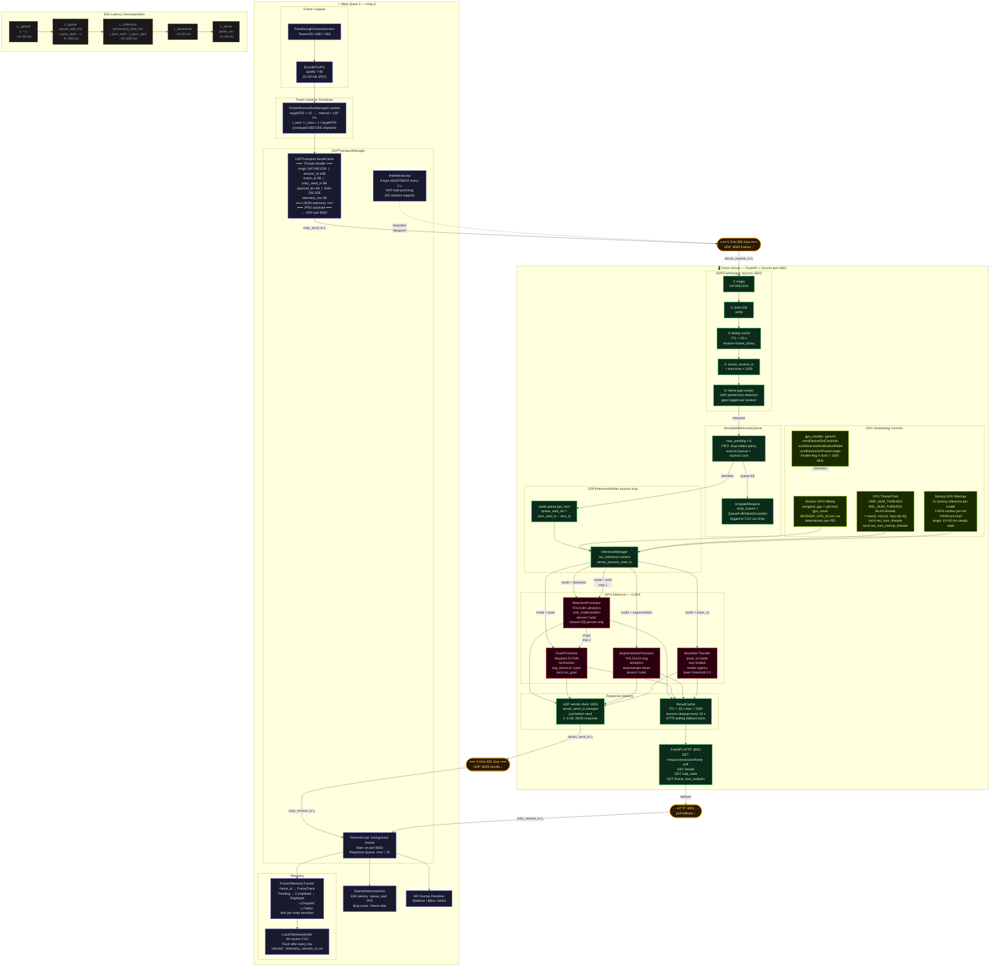
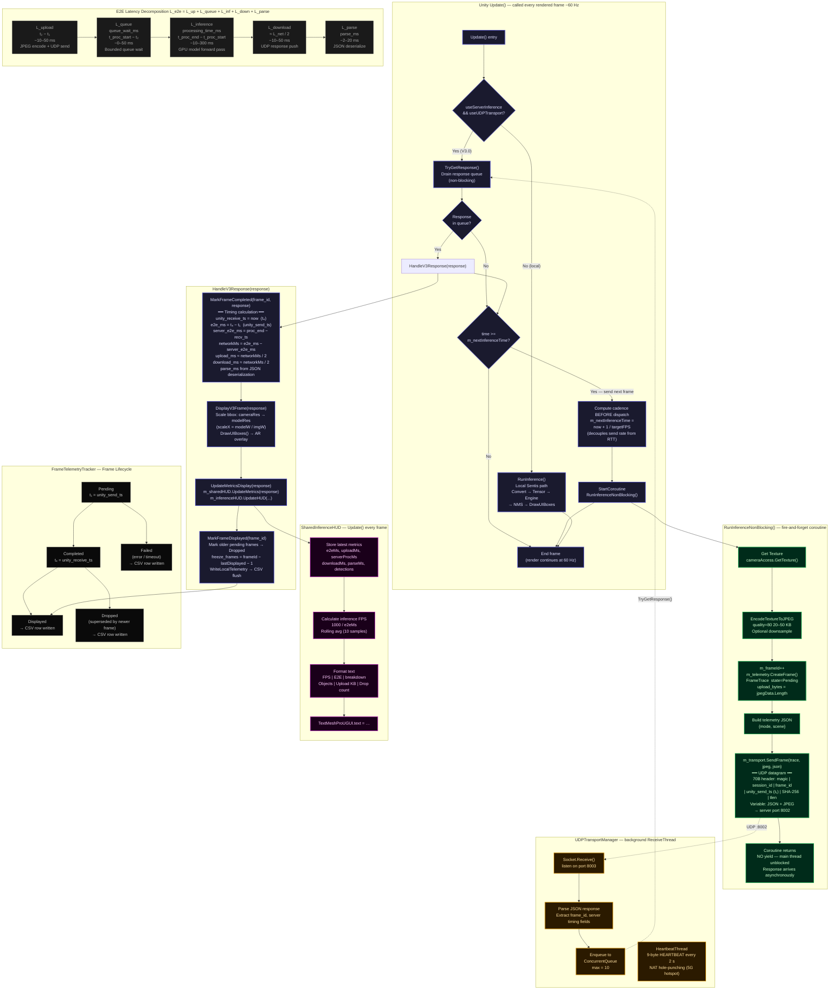

# System Architecture Diagram

Paste the code block below into [Mermaid Live Editor](https://mermaid.live) to render.

---

## V3.0 Detailed Logic Flow

> Paste into [Mermaid Live Editor](https://mermaid.live) — use as **Fig. 2** in paper (detail view of latency critical path).

---

## Component Quick Reference

| Layer | Component | Role |
|-------|-----------|------|
| VR | `PassthroughCameraAccess` | Capture 1280×960 passthrough frames |
| VR | `UDPTransport.SendFrame()` | Binary protocol, 70B header + SHA-256 |
| VR | `UDPTransportManager` | Background send/recv threads, NAT keepalive |
| VR | `FrameTelemetryTracker` | Frame state machine, 39-col CSV writer |
| VR | `SharedInferenceHUD` | Real-time latency / drop display |
| Net | UDP :8002 | Frame upload (non-blocking fire-and-forget) |
| Net | UDP :8003 | Result push-back (server-initiated) |
| Net | HTTP :8001 | Poll fallback (`GET /response/{session}/{frame}`) |
| Server | `UDPFrameIngest` | Magic + SHA-256 + dedup + receive timestamp |
| Server | `BoundedAdmissionQueue` | max_pending=6, FIFO drop-oldest |
| Server | `UDPInferenceWorker` | Single asyncio loop, measures `queue_wait_ms` |
| Server | `InferenceManager` | Mode routing to GPU processors |
| GPU | `DetectionProcessor` | YOLOv8n, `device='cuda'`, person-only |
| GPU | `PoseProcessor` | Keypoint R-CNN, torchvision, crops |
| GPU | `SegmentationProcessor` | YOLOv11n-seg, downsampled masks |
| GPU | MoveNet Thunder | `pose_v2`, lazy-loaded, lower threshold |
| Sched | `pid % gpu_count` | Deterministic worker–GPU affinity |
| Sched | `OMP/MKL_NUM_THREADS` | CPU thread-pool bound per worker |
| Sched | `gpu_monitor` (pynvml) | Clock MHz / util% / power W / throttle flag |
| Server | `ResultCache` | TTL=30s, HTTP fallback store |
